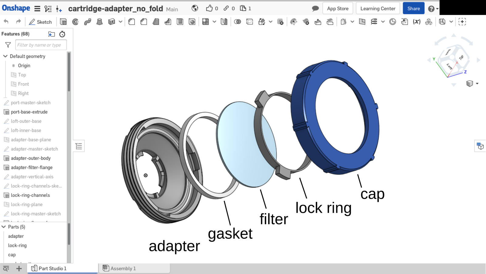
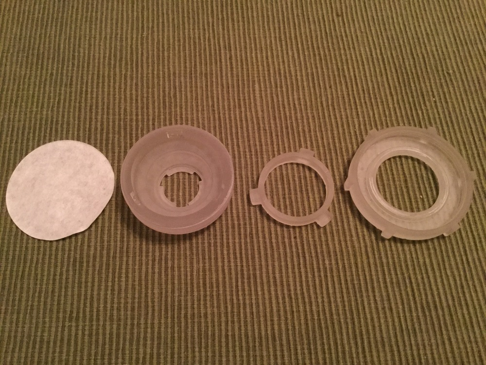
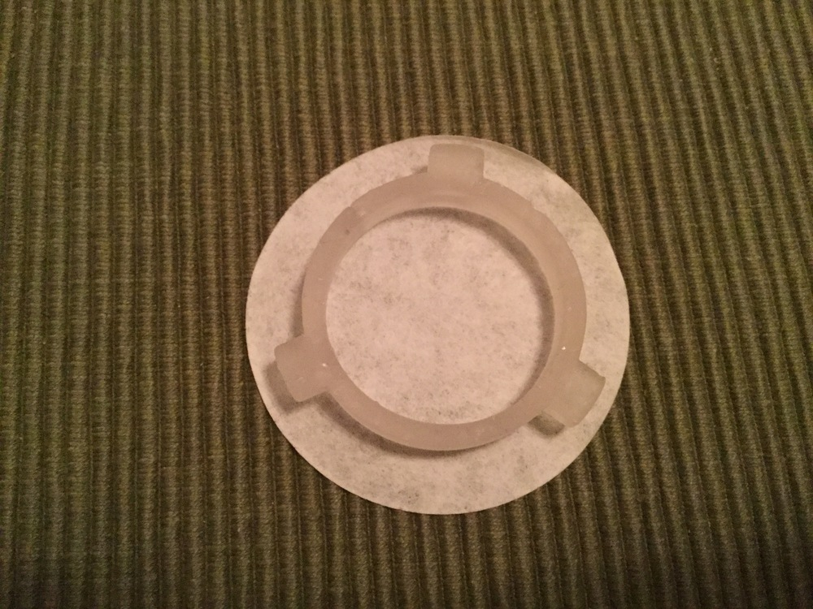
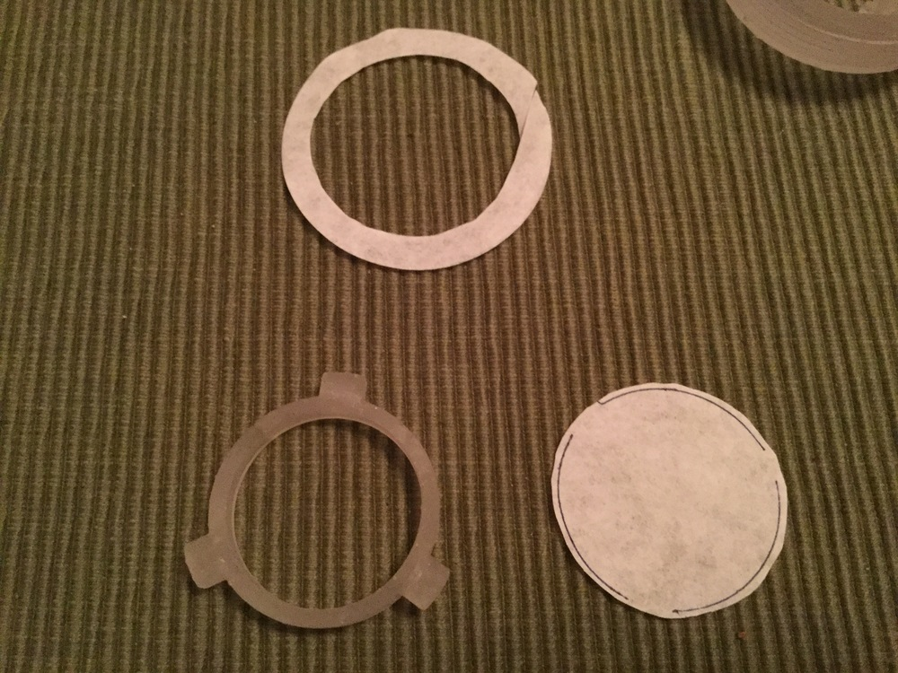
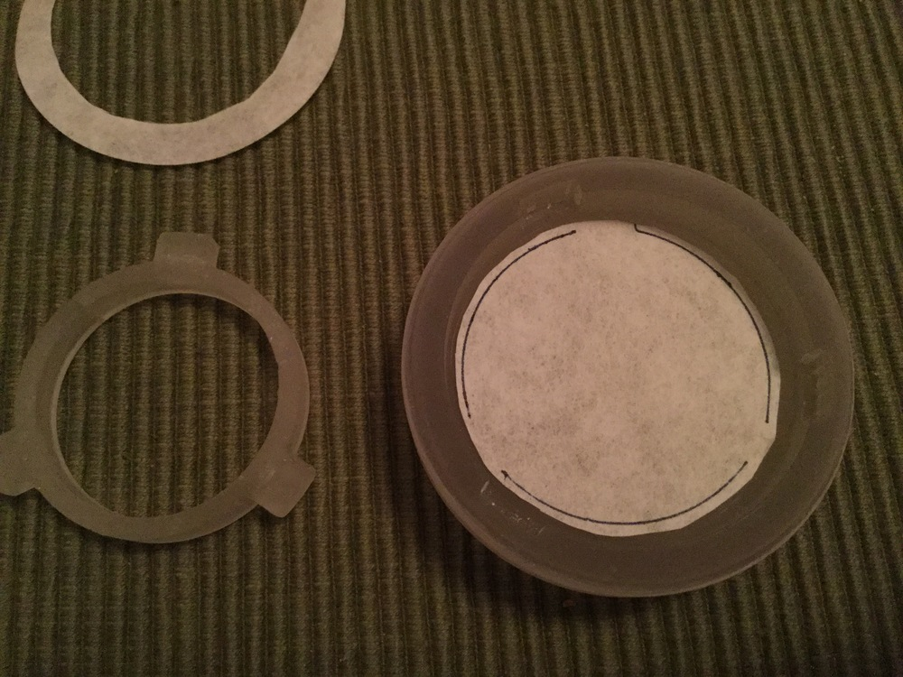
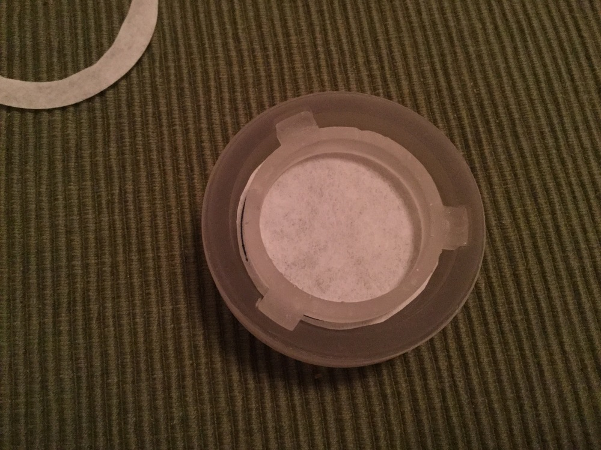
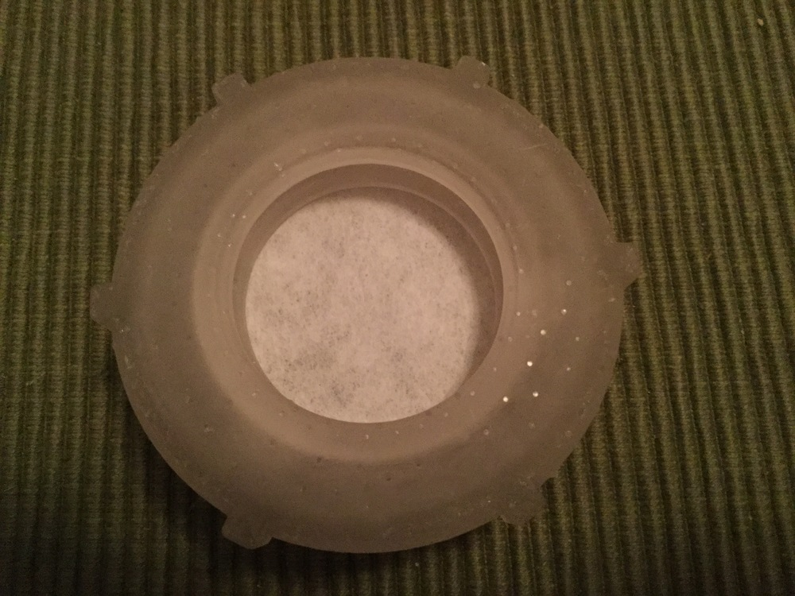
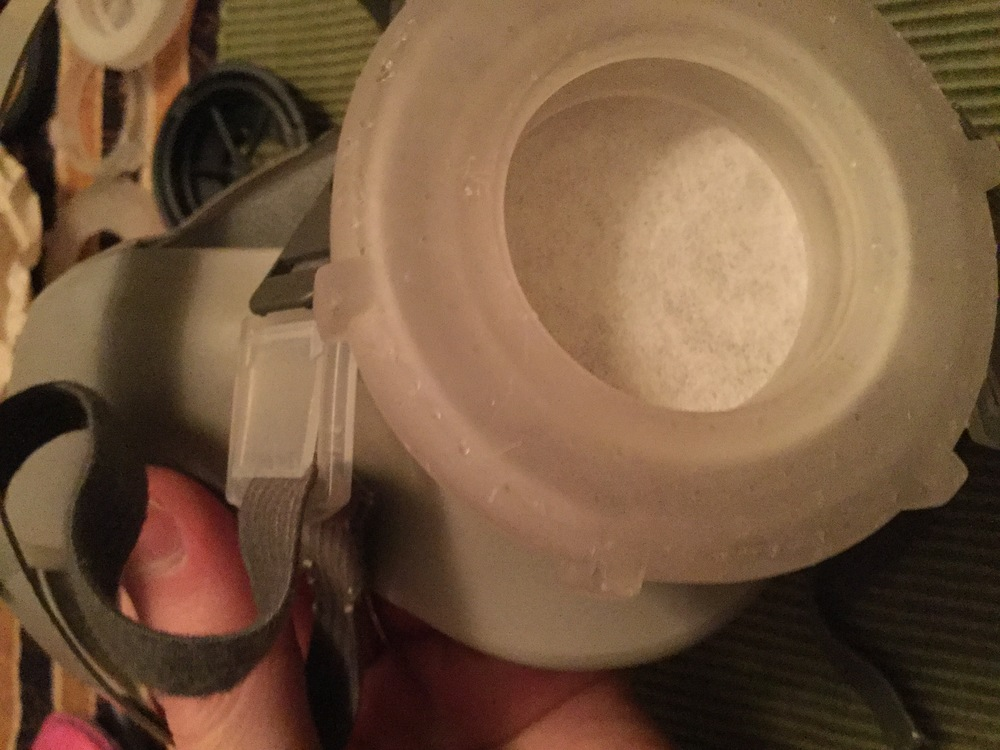

# Universal Facepiece Filter Adapter

## Overview

The universal filter adapter is designed to mount and adapt filter media onto existing half facepiece respirators, such as those made by 3M and MSA. 

Existing respirator bases made by 3M and MSA have a twist-lock port mechanism to mount filter cartridges. These existing respirator bases already meet standards for sealing around a face and for mating with a filter cartridge. They are also durable, easy to use and clean, and widely available. Expert advice exists on how to clean and maintain them, and many already know how to use them.

The adapter replaces the filter cartridge in attaching to a respirator’s port. The adapter allows many media types to mount on an approved respirator, so that the mask will perform at the characteristics of the filter. The filter can be removed, sterilized, and re-used later without degradation from use in the adapter. The adapter components are easy to clean separately by hand.

**Project Status**

The model and prototype are currently being finalized; successive prototypes are being printed on a 3d printer, and tested.

Still to be done:

- gather feedback from doctors/hospitals on use, requirements, and processes;
- gather feedback from engineers on holding mechanisms and manufacturing ability.
- optimize the design by removing weight, unneeded features

**Adapter Overview**

The adapter is a collection of plastic components for holding a circular filter securely in an adapter cartridge. The adapter consists of an adapter base, a lock ring, a screw-on cap, and a filter gasket. When assembled with a filter in place, mating faces on the adapter base and lock ring sandwich the filter and gasket together. The cap screws onto the adapter base, and presses the lock ring against the filter. Divots in the adapter prevent the lock ring from rotating while pressing into the filter, isolating the the filter from the cap’s rotation. A support grate can be inserted into the base to support the filter.

**Using the adapter**

The adapter can fit filters of up to 3mm (compressed thickness). It is currently sized to fit a [3M 6200 half facepiece respirator](https://www.3m.com/3M/en_US/company-us/all-3m-products/~/3M-Half-Facepiece-Reusable-Respirator-6200-07025-AAD-Medium-24-EA-Case/?N=5002385+3294780295&rt=rud).

To use a filter with the adapter:

- cut the filter into a circle. The circle size depends on the adapter; 2” is a good size.
- insert the filter (or stack of filters) into the adapter.
- place the lock ring into the adapter, with the tabs towards the top.
- screw the cap on until everything is tight.

When the adapter is removed, the inside of the adapter and filter can be protected by sealing the port’s flat face; this allows for storage and re-use without having to clean the filter.

**Quickstart — Resources**

The onshape file for the [model is here](https://cad.onshape.com/documents/8a7a296d8c94c1d83db471e0/w/b3b2d533096523571fca6dd0/e/4dc70fe7d46258aa873a24d5). See the [using the cad model](#using-the-cad-model) section for information on parameterizing the model for a specific filter and gasket thickness.

The model holds the consists of the adapter base, a lock ring, a screw-on cap, and a gasket pattern. When assembled, the gasket, filter, and lock ring are placed inside the adapter base, with the screw-on cap pressing the lock ring into the adapter.

Some related resources about fitting a respirator, cleaning a respirator base, and understanding mask classifications can be found here:

- [3M fitting and testing instructions](https://multimedia.3m.com/mws/media/40742O/3m-elastomeric-half-facepiece-respirator-fitting-poster.pdf)
- [3M respirator base cleaning](https://multimedia.3m.com/mws/media/133586O/3m-reusable-respirator-inspection-cleaning-storage-procedures.pdf)
- [Surgical Masks, Surgical Respirators, and Respirators](https://multimedia.3m.com/mws/media/1794572O/surgical-n95-vs-standard-n95-which-to-consider.pdf)
- 3M filter types
# Details
## Use Instructions

The adapter parts and a demo filter will be assembled. No gasket is shown:

The filter needs to be cut into a circle, to fit the adapter. In this example, the lock ring is used to mark the filter. A circular cutter could also be used:

The filter is cut out, leaving a little extra; the lock ring leaves a ~1/16” margin for excess filter. It is then inserted into the adapter. A gasket would be inserted underneath the filter:

The lock ring is placed in the channels, with the tabs towards the top. The cap is then tightened around the adapter until snug:

With the filter inserted and locked in place, the adapter can be mounted on a facepiece base:

## Motivation

In the current coronavirus pandemic (written March 24th, 2020), a shortage of N95 surgical respirators threatens the health and safety of medical providers caring for the sick. This shortage has been reported as occurring because of purchase of these masks by the public, and by a lack of supply from mask factories.

This adapter is based on the use of an industrial respirator facepiece, and can help mitigate the shortage by supporting flexible use and field-installation of other filter media, using less filter media, and allowing filter media to last longer with sterilization/cleaning.

Industrial respirators can be used to protect against biohazards. Respirators on this type filter out inhaled particles, and do not not filter exhalations. Medical respirators filter both inhalations and exhalations. This exhalation concern is not a priority in treating coronavirus, and filtering the inhalations of a medical provider will still protect them.
 
**Flexible Use of Filter Media**

Many filters meet the same filtration requirements as N95, but are not available in an appropriate cartridge or mask. Some examples of filters are those used in HVAC systems, vacuum cleaner bags and filters, and household air scrubbers. The adapter allows any filter media of 0 to 3mm (compressed size, including gasket) to be used in the system, in a way that preserves its effectiveness.

**Field-Installation of Filter Media**

Many filter cartridges are made in factory settings, using cartridge sealing tools that are expensive, limited in availability, and require training and skill to use. This adapters allows effective use of a filter cut with a pair of scissors and installed with (clean) hands. 

**Minimal use of Filter Media**

Many disposable respirator designs minimize cost by making most of the mask out of the filter media (normally cheap and available), and mounting elastic bands and metal adjustment bridges directly on the filter. As a result, the mask contains several times the amount of filter material needed to support breathing. The adapter can use only as much material as needed; the model can be programmed with the diameter of the filter needed.

Some respirators are also limited by the lifetime of the attached elastic band or the bridges; because these components are more durable and serviceable on industrial respirators, these can extend the filter lifetime.

The filter used in the adapter can be removed and cleaned separately; clamping it in the adapter does not degrade the filter.

## Adapter Models

The adapter model is available as a part file to download, and an online CAD workspace that can be copied for minor size changes (and major adaptations).

Two adapter versions exist. The cap-screw version has a threaded cap and adapter that screw together; this supports any filter thickness from 0-3mm. (The model can be programmed to support a wider range of filter thicknesses, or to support a narrower range of thicknesses with less plastic.)

The twist-lock version has a cap that seats in one position on the adapter; it is an identical mechanism to the twist-lock mechanism on the cartridge’s base. This version is programmed for use with a specific filter thickness; the lock ring’s size can vary, and is paired with an intended filter and compressed gasket size. Only the lock ring size varies, supporting a specific filter thickness in a range of 0-3mm.

**Components and Links**

The online model of the adapter is available here:

- [adapter, cap-screw version](https://cad.onshape.com/documents/8a7a296d8c94c1d83db471e0/w/b3b2d533096523571fca6dd0/e/4dc70fe7d46258aa873a24d5)
- [adapter, twist-lock version](https://cad.onshape.com/documents/8e179cf6da81d34311581fbd/w/e2bd6730ce34aa5022054186/e/e10aa523208e76306eee1431?configuration=List_OtGgUY98RzLmMe%3DDefault)

The basic elements of the ports on the cartridge and respirator base are available here:

- [cartridge filter port](https://cad.onshape.com/documents/8ca7993d0dbdf6dec0b88c16/w/378ac1ed93f47acbf7e58e80/e/63864b1ca14c548cc1cdd123)
- [respirator base port](https://cad.onshape.com/documents/df0ceb4cae6abfa757defdbb/w/aaa47164c66194a30278e08d/e/e499159fdd9c14fca5813e95)

## Using the CAD Model

The CAD model can be programmed for:

- the diameter of the filter used
- the compressed, installed thickness of the filter and gasket
- the overall range of filter thicknesses 

The CAD model can also be configured for 3D printer tolerances.

## Supporting Research

This 3M article examines half facepiece respirator use for biohazard protection, giving information on the ability of these respirators to remove biohazards and whether biohazards can migrate through the filter once they’ve settled:

>An often-expressed question is whether biological aerosols are removed by respirator filters the same as non-biological aerosols. Due to concerns on the efficacy of respirator filters for Mycobacterium tuberculosis (TB), many studies have been conducted using bioaerosols…. These experiments found no significant difference in the filtration of biological aerosols and non-biological aerosols with similar physical properties – in other words, filtration efficiency is based on particle size rather than the nature of the particle’s origin. (page 5)

>One of these studies looked for migration of the organism to the inside of the filtering facepiece respirator and concluded that respirators may be reused over time with little risk of internal contamination, even after a week’s time, provided the respirator is carefully handled and stored (handled by non-filter components, e.g., straps). The investigators felt any internal contamination from environmental bacteria was due to handling (removal from bag to sample). (page 6)

https://multimedia.3m.com/mws/media/409903O/respiratory-protection-against-biohazards.pdf

## Related Resources

Filter overview:
https://multimedia.3m.com/mws/media/565214O/3m-cartridge-filter-guide-and-brochure.pdf

UNebraska UV Sanitization Regimen:
https://www.nebraskamed.com/sites/default/files/documents/covid-19/n-95-decon-process.pdf

MSA safety overview:
http://s7d9.scene7.com/is/content/minesafetyappliances/Key%20Elements%20of%20a%20Sound%20Respiratory%20Protection%20Program%20Bulletin%20-%20EN

3M fit brochure:
https://multimedia.3m.com/mws/media/40742O/3m-elastomeric-half-facepiece-respirator-fitting-poster.pdf

3M respirator cleaning:
https://multimedia.3m.com/mws/media/133586O/3m-reusable-respirator-inspection-cleaning-storage-procedures.pdf

3M comparison of n95, surgical n95, and surgical masks:
https://multimedia.3m.com/mws/media/1794572O/surgical-n95-vs-standard-n95-which-to-consider.pdf
